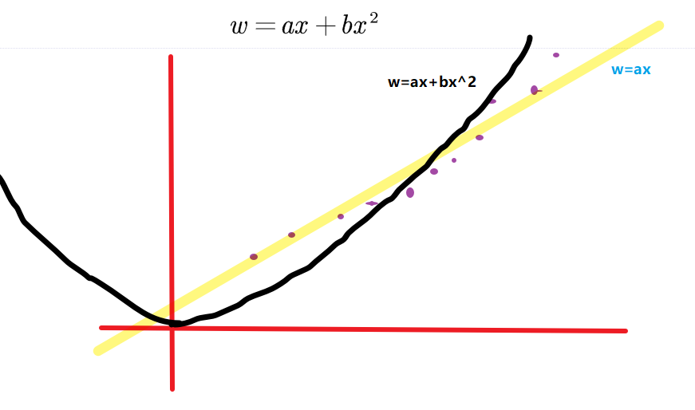

# 机器学习算法_基于逻辑回归的分类预测

>   学习及学习笔记
>
>   另外github不太支持latex语法，于是使用图片推导

[toc]

>   课前学习：高等数学的微积分部分

## 逻辑回归的介绍

**逻辑回归**（Logistic regression，简称LR）虽然其中带有"回归"两个字，但逻辑回归其实是一个**分类模型**，并且广泛应用于各个领域之中。虽然现在深度学习相对于这些传统方法更为火热，但实则这些传统方法由于其独特的优势依然广泛应用于各个领域中。

>   (备注：机器学习包括符号方面的也算，在好几年前，符号机器学习占主要地位，所以来说相对还是比较重要，只是进些年来讲，深度学习能解决的问题基于大数据，更容易发挥其作用。这里要提到算力，计算能力。)

而对于逻辑回归而言，最为突出的两点就是其**模型简单和模型的可解释性强**。

逻辑回归模型的优劣势:

优点：实现简单，易于理解和实现；计算代价不高，速度很快，存储资源低；

>   计算代价不高(这里的意思是计算机所要求的算力不用太强，这里类比一下后面的图像识别的机器学习，卷积轴所需要的就是极大的算力，计算大量数据的能力，神经网络也是)

缺点：容易欠拟合

>   （这里我们可以使用正则的方式降低数据过拟合，数学建模中也常常使用），分类精度可能不高


**Logistic 曲线，就是我们所说的种族生长曲线，就是s型曲线。**在数学建模的领域中也常常被使用到，可以作为一种预测模型。


## 正则化的内容

数据拟合的一类，这里我多提供一个正则化的内容（减少过拟合）：

法一：岭回归

```python
基于数组构建并拟合模型的调用格式为:
import statsmodels.api as sm
sm.OLS(y,X).fit()
```

稍微介绍下正则化：相当于减少了高次方的数据，导致拟合不会过度。这里只是简单的举例，了解了解是可以的，未来我们会学到。不过稍微不太一样。



这里我再次使用吴恩达老师上课时的做法：


x的次数越高，拟合的越好，但相应的预测的能力就可能变差。正则化： 保留所有的特征，但是减少参数的大小。


**逻辑回归的应用**

逻辑回归模型广泛用于各个领域，包括机器学习，大多数医学领域和社会科学。例如，最初由Boyd 等人开发的创伤和损伤严重度评分（TRISS）被广泛用于**预测受伤患者的死亡率**，使用逻辑回归 基于观察到的**患者特征**（年龄，性别，体重指数,各种血液检查的结果等）**分析预测**发生特定疾病（例如糖尿病，冠心病）的风险。逻辑回归模型也用于预测在给定的过程中，系统或产品的故障的可能性。还用于市场营销应用程序，例如**预测客户购买产品或中止订购的倾向**等。在经济学中它可以用来预测一个人选择进入劳动力市场的可能性，而商业应用则可以用来预测房主拖欠抵押贷款的可能性。条件随机字段是逻辑回归到顺序数据的扩展，用于自然语言处理。

逻辑回归模型现在同样是很多分类算法的基础组件,比如 分类任务中基于GBDT算法+LR逻辑回归实现的信用卡交易反欺诈，CTR(点击通过率)预估等，其好处在于输出值自然地落在0到1之间，并且有概率意义。模型清晰，有对应的概率学理论基础。它拟合出来的参数就代表了每一个特征(feature)对结果的影响。也是一个理解数据的好工具。但同时由于其本质上是一个线性的分类器，所以不能应对较为复杂的数据情况。很多时候我们也会拿逻辑回归模型去做一些任务尝试的基线（基础水平）。

>   总结：一般根据学习者的数据属性，每一个变量相当于一种属性，根据属性的不同，控制函数分类的区域不同，然后分类预测不同的人差不多的数据属性的值。


>   >   >   本次任务：了解逻辑回归理论，使用sklearn函数，运用到鸢尾花数据中

2.1 代码流程
Part1 Demo实践

 Step1:库函数导入
 Step2:模型训练 
 Step3:模型参数查看 
 Step4:数据和模型可视化 
 Step5:模型预测

Part2 基于鸢尾花（iris）数据集的逻辑回归分类实践

 Step1:库函数导入 
 Step2:数据读取/载入 
 Step3:数据信息简单查看 
 Step4:可视化描述 
 Step5:利用 逻辑回归模型 在二分类上 进行训练和预测 
 Step6:利用 逻辑回归模型 在三分类(多分类)上 进行训练和预测


## 代码实现

### 第一部分 程序基础

#### 库文件的导入

```python
##  基础函数库
import numpy as np 

## 导入画图库
import matplotlib.pyplot as plt
import seaborn as sns 

## 导入逻辑回归模型函数  Logistic 训练模型
from sklearn.linear_model import LogisticRegression  #这个是导入sklearn里面的LogisticRegression库
```


#### 模型训练

```python
##Demo演示LogisticRegression分类

## 构造数据集
x_fearures = np.array([[-1,-2],
                       [-2,-1],
                       [-3,-2],
                       [ 1, 3],
                       [ 2, 1],
                       [ 3, 2]])

y_label = np.array([0,0,0,1,1,1])

## 调用逻辑回归模型
lr_clf = LogisticRegression()

## 用逻辑回归模型拟合构造的数据集
lr_clf = lr_clf.fit(x_fearures, y_label) 	#一般.fit()都是训练机器模型
#其拟合方程为 y=w0+w1*x1+w2*x2
```

这里的x矩阵为
$$
y=w_0+w_1\times x_1+w_2\times x_2;\ \ 
x=
\begin{pmatrix}
-1& -2\\
-2& -1\\
-3& -2\\
 1&  3\\
 2&  1\\
 3&  2\\
\end{pmatrix};
y=\begin{pmatrix}
0 &0 &0 &1 &1 &1
\end{pmatrix};\\注：这里的x要加一列1，因为为常数项
$$
所以要设w矩阵
$$
w=
\begin{pmatrix}
w_1 & w_2 & w_3
\end{pmatrix}; \ \ \ \ y^T = x \times w\\

y^T
\begin{pmatrix}
0 \\0 \\0 \\1 \\1 \\1
\end{pmatrix} 
=
x \begin{pmatrix}
1 & -1& -2\\
1 & -2& -1\\
1 & -3& -2\\
1 &  1&  3\\
1 &  2&  1\\
1 &  3&  2\\
\end{pmatrix} \times
w
\begin{pmatrix}
w_1 & w_2 & w_3
\end{pmatrix}
$$


类似训练方法，求出恰当的w值，这里只用保证接近就好，不是一定能算出准确的值。


#### 模型参数查看

```python
##查看其对应模型的w
print('the weight of Logistic Regression:',lr_clf.coef_)
#>>> the weight of Logistic Regression:[[0.73462087 0.6947908]]

##查看其对应模型的w0
print('the intercept(w0) of Logistic Regression:',lr_clf.intercept_)
#>>> the intercept(w0) of Logistic Regression:[-0.03643213]
```


#### 数据和模型可视化

```python
## 可视化构造的数据样本点

plt.figure() # 初始化窗口

#散点图设置  在附录有相关设置
plt.scatter(x_fearures[:,0],x_fearures[:,1], c=y_label, s=50, cmap='viridis')
#设置标题
plt.title('Dataset')
#展示
plt.show()

##画出决策边界
plt.figure() 
plt.scatter(x_fearures[:,0],x_fearures[:,1], c=y_label, s=50, cmap='viridis')
plt.title('Dataset')

nx, ny = 200, 100  			#控制步长
x_min, x_max = plt.xlim()   #设置坐标轴的范围
y_min, y_max = plt.ylim()
							#下：设置网格，这里控制网格的格数
x_grid, y_grid = np.meshgrid(np.linspace(x_min, x_max, nx),np.linspace(y_min, y_max, ny))

#这为训练得到一条较为好的坐标点，分割数据的线
z_proba = lr_clf.predict_proba(np.c_[x_grid.ravel(), y_grid.ravel()])

#这为获取矩阵的维数来改变矩阵形状（可能是概率矩阵）
z_proba = z_proba[:, 1].reshape(x_grid.shape)

# 等高线 contour 线的设置与绘图
plt.contour(x_grid, y_grid, z_proba, [0.5], linewidths=2., colors='blue')

plt.show()

### 可视化预测新样本
plt.figure()

## new point 1
x_fearures_new1 = np.array([[0, -1]])
plt.scatter(x_fearures_new1[:,0],x_fearures_new1[:,1], s=50, cmap='viridis')

#设置注释：s\text（这里修改，3.3以上为text）内容，xy坐标，文字坐标xytext，color颜色，
##plt.annotate(s='New point 1',xy=(0,-1),xytext=(-2,0),color='blue',arrowprops=dict(arrowstyle='-|>',connectionstyle='arc3',color='red'))
plt.annotate(text='New point 1',xy=(0,-1),xytext=(-2,0),color='blue',arrowprops=dict(arrowstyle='-|>',connectionstyle='arc3',color='red'))

## new point 2  同上
x_fearures_new2 = np.array([[1, 2]])
plt.scatter(x_fearures_new2[:,0],x_fearures_new2[:,1], s=50, cmap='viridis')

##plt.annotate(s='New point 2',xy=(1,2),xytext=(-1.5,2.5),color='red',arrowprops=dict(arrowstyle='-|>',connectionstyle='arc3',color='red'))
plt.annotate(text='New point 2',xy=(1,2),xytext=(-1.5,2.5),color='red',arrowprops=dict(arrowstyle='-|>',connectionstyle='arc3',color='red'))

## 训练样本
plt.scatter(x_fearures[:,0],x_fearures[:,1], c=y_label, s=50, cmap='viridis')
plt.title('Dataset')

# 可视化决策边界
plt.contour(x_grid, y_grid, z_proba, [0.5], linewidths=2., colors='blue')

plt.show()

```


#### 模型预测

```python
##在训练集和测试集上分布利用训练好的模型进行预测
y_label_new1_predict=lr_clf.predict(x_fearures_new1)#(0,-1)->属0区
y_label_new2_predict=lr_clf.predict(x_fearures_new2)#(1,2)->属1区
print('The New point 1 predict class:\n',y_label_new1_predict)
print('The New point 2 predict class:\n',y_label_new2_predict)
##TheNewpoint1predictclass:
##[0]
##ThseNewpoint2predictclass:
##[1]

##由于逻辑回归模型是概率预测模型（前文介绍的p = p(y=1|x,\theta)）,所有我们可以利用predict_proba函数预测其概率
y_label_new1_predict_proba=lr_clf.predict_proba(x_fearures_new1)
y_label_new2_predict_proba=lr_clf.predict_proba(x_fearures_new2)
print('The New point 1 predict Probability of each class:\n',y_label_new1_predict_proba)
print('The New point 2 predict Probability of each class:\n',y_label_new2_predict_proba)
##TheNewpoint1predictProbabilityofeachclass:
##[[0.69567724  0.30432276]]
##TheNewpoint2predictProbabilityofeachclass:
##[[0.11983936  0.88016064]]
     为0的概率      为1的概率
###可以发现训练好的回归模型将X_new1预测为了类别0（判别面左下侧），X_new2预测为了类别1（判别面右上侧）。其训练得到的逻辑回归模型的概率为0.5的判别面为上图中蓝色的线。
```


### 程序应用

**基于鸢尾花（iris）数据集的逻辑回归分类实践**

和上面的方法一样，首先都要进行库的导入

*   numpy （Python进行科学计算的基础软件包）

*   pandas（pandas是一种快速，强大，灵活且易于使用的开源数据分析和处理工具）

*   matplotlib和seaborn绘图工具

#### 库的导入

```python
##  基础函数库
import numpy as np 
import pandas as pd

## 绘图函数库
import matplotlib.pyplot as plt
import seaborn as sns
```

本次我们选择鸢花数据（iris）进行方法的尝试训练，该数据集一共包含5个变量，其中4个特征变量，**1个目标分类变量**。共有150个样本，目标变量为 花的类别 其都属于鸢尾属下的三个亚属，分别是山鸢尾 (Iris-setosa)，变色鸢尾(Iris-versicolor)和维吉尼亚鸢尾(Iris-virginica)。包含的三种鸢尾花的**四个特征**，分别是花萼长度(cm)、花萼宽度(cm)、花瓣长度(cm)、花瓣宽度(cm)，这些形态特征在过去被用来识别物种。

| 变量         | 描述                                                         |
| ------------ | ------------------------------------------------------------ |
| sepal length | 花萼长度(cm)                                                 |
| sepal width  | 花萼宽度(cm)                                                 |
| petal length | 花瓣长度(cm)                                                 |
| petal width  | 花瓣宽度(cm)                                                 |
| target       | 鸢尾的三个亚属类别,'setosa'(0), 'versicolor'(1), 'virginica'(2) |

>   机器学习呢就是需要进行数据的不断分类，能够根据特征等因素来训练我们的函数，从而达到数据分类的目标。


#### 数据读取/载入

```python
#我们利用sklearn中自带的iris数据作为数据载入，并利用Pandas转化为DataFrame格式
from sklearn.datasets import load_iris
data = load_iris() 					#得到数据特征
# print("iris数据是怎样子的，然后再处理：\n",data)
iris_target = data.target 			#得到数据对应的标签,即属于那种类别植物
iris_features = pd.DataFrame(data=data.data, columns=data.feature_names) 		 #利用Pandas转化为DataFrame格式
```

输出的iris数据，可以看到是字典类型，我们找到自己所要的数据，然后分类获取。

#### 数据信息简单查看

处理完原始的数据，我们进行分类后，查看是否是自己所要的数据集。

```python
##利用.info()查看数据的整体信息
iris_features.info()
'''数据集的信息
<class 'pandas.core.frame.DataFrame'>		#类型
RangeIndex: 150 entries, 0 to 149			#数据描述
Data columns (total 4 columns):
sepal length (cm)    150 non-null float64	#数据类型及个数
sepal width (cm)     150 non-null float64
petal length (cm)    150 non-null float64
petal width (cm)     150 non-null float64
dtypes: float64(4)							#分类数据的类型
memory usage: 4.8 KB						#数据大小
'''


##进行简单的数据查看，我们可以利用.head()头部.tail()尾部
#查看数据的头尾，一般只列出来5个
iris_features.head()
iris_features.tail()


##查看标签
#标签的0，1，2分别代表'setosa','versicolor','virginica'三种不同花的类别
iris_target


##利用value_counts函数查看每个类别数量
#差不多就是计算每个标签的数目
pd.Series(iris_target).value_counts()


##对于特征进行一些统计描述
#列写出数据的：count个数、mean平均值、std中位值、min最小、25%1/4... max最大
iris_features.describe()
#从统计描述中我们可以看到不同数值特征的变化范围。

#上面的如果没有输出那么使用文本编辑的ide的话用：
print(iris_features.info())
print(iris_features.head())
print(iris_features.tail())
print(iris_target)
print(pd.Series(iris_target).value_counts())
print(iris_features.describe())

```


#### 可视化描述

```python
## 合并标签和特征信息
iris_all = iris_features.copy() ##进行浅拷贝，防止对于原始数据的修改
iris_all['target'] = iris_target
#print(iris_all['target'])
```

```python
## 特征与标签组合的散点可视化
sns.pairplot(data=iris_all,diag_kind='hist', hue= 'target')
plt.show()
```


从上图可以发现，在2D情况下不同的特征组合对于不同类别的花的散点分布，以及大概的区分能力。

```python
#箱线图
for col in iris_features.columns:
    sns.boxplot(x='target', y=col, saturation=0.5, 
palette='pastel', data=iris_all)
    plt.title(col)
    plt.show()
```


有同学不理解箱线图什么意思：

*   箱子：是整个数据的上四分位数和下四分位数，算是数据的上限和下限(这里不是最值)
*   箱子中的横线：是数据的中位数，代表样本的平均水平
*   箱子以外的横线，代表最大值或最小值
*   下面或上面几个点：异常值，就太过于偏离平均数据，这里相当于变异的花。

利用箱型图我们也可以得到不同类别在不同特征上的分布差异情况。


```python
# 选取其前三个特征绘制三维散点图
#导入绘制3D图的数据库
from mpl_toolkits.mplot3d import Axes3D
#初始化窗口
fig = plt.figure(figsize=(10,8))
#绘制子网图，这里的111 就代表一个大图
ax = fig.add_subplot(111, projection='3d')
#分类别绘制
iris_all_class0 = iris_all[iris_all['target']==0].values
iris_all_class1 = iris_all[iris_all['target']==1].values
iris_all_class2 = iris_all[iris_all['target']==2].values
# 'setosa'(0), 'versicolor'(1), 'virginica'(2)
#根据所分的类别，绘制不同颜色的散点图
ax.scatter(iris_all_class0[:,0], iris_all_class0[:,1], iris_all_class0[:,2],label='setosa')
ax.scatter(iris_all_class1[:,0], iris_all_class1[:,1], iris_all_class1[:,2],label='versicolor')
ax.scatter(iris_all_class2[:,0], iris_all_class2[:,1], iris_all_class2[:,2],label='virginica')
plt.legend()
plt.show()
```


#### 利用 逻辑回归模型 在二分类上 进行训练和预测

```python
##为了正确评估模型性能，将数据划分为训练集和测试集，并在训练集上训练模型，在测试集上验证模型性能。
#导入测试数据集
from sklearn.model_selection import train_test_split

#查看此数据
print(iris_features,'\n',iris_target)

##选择其类别为0和1的样本（不包括类别为2的样本）
iris_features_part=iris_features.iloc[:100]
iris_target_part=iris_target[:100]

##测试集大小为20%，80%/20%分  也不一定，37分也是可以的
x_train,x_test,y_train,y_test=train_test_split(iris_features_part,iris_target_part,test_size=0.2,random_state=2020)
```

因为二分类常常适用于两种类型的分类当中，这里就取了前两类样本

```python
##从sklearn中导入逻辑回归模型
from sklearn.linear_model import LogisticRegression

##定义逻辑回归模型
clf=LogisticRegression(random_state=0,solver='lbfgs')

##在训练集上训练逻辑回归模型
clf.fit(x_train,y_train)

##查看其对应的w
print('the weight of Logistic Regression:',clf.coef_)

##查看其对应的w0
print('the intercept(w0) of Logistic Regression:',clf.intercept_)

##在训练集和测试集上分布利用训练好的模型进行预测
train_predict=clf.predict(x_train)
test_predict=clf.predict(x_test)

from sklearn import metrics
##利用accuracy（准确度）【预测正确的样本数目占总预测样本数目的比例】评估模型效果
print('The accuracy of the Logistic Regression is:',metrics.accuracy_score(y_train,train_predict))
print('The accuracy of the Logistic Regression is:',metrics.accuracy_score(y_test,test_predict))

##查看混淆矩阵(预测值和真实值的各类情况统计矩阵)
confusion_matrix_result=metrics.confusion_matrix(test_predict,y_test)
print('The confusion matrix result:\n',confusion_matrix_result)

##利用热力图对于结果进行可视化
plt.figure(figsize=(8,6))
sns.heatmap(confusion_matrix_result,annot=True,cmap='Blues')
plt.xlabel('Predictedlabels')
plt.ylabel('Truelabels')
plt.show()

##The accuracy of the Logistic Regressionis:1.0
##The accuracy of the Logistic Regressionis:1.0
##The confusion matrix result:
##[[9  0]
##[0  11]]
我们可以发现其准确度为1，代表所有的样本都预测正确了。
```


#### 利用 逻辑回归模型 在三分类(多分类)上 进行训练和预测

``` python
##测试集大小为20%，80%/20%分
x_train,x_test,y_train,y_test=train_test_split(iris_features,iris_target,test_size=0.2,random_state=2020)

##定义逻辑回归模型
clf=LogisticRegression(random_state=0,solver='lbfgs')

##在训练集上训练逻辑回归模型
clf.fit(x_train,y_train)

##查看其对应的w
print('the weight of Logistic Regression:\n',clf.coef_)
##查看其对应的w0
print('the intercept(w0) of Logistic Regression:\n',clf.intercept_)
##由于这个是3分类，所有我们这里得到了三个逻辑回归模型的参数，其三个逻辑回归组合起来即可实现三分类

##在训练集和测试集上分布利用训练好的模型进行预测
train_predict=clf.predict(x_train)
test_predict=clf.predict(x_test)
##由于逻辑回归模型是概率预测模型（前文介绍的p=p(y=1|x,\theta)）,所有我们可以利用predict_proba函数预测其概率

train_predict_proba=clf.predict_proba(x_train)
test_predict_proba=clf.predict_proba(x_test)

print('The test predict Probability of each class:\n',test_predict_proba)
##其中第一列代表预测为0类的概率，第二列代表预测为1类的概率，第三列代表预测为2类的概率。

##利用accuracy（准确度）【预测正确的样本数目占总预测样本数目的比例】评估模型效果
print('The accuracy of the Logistic Regression is:',metrics.accuracy_score(y_train,train_predict))
print('The accuracy of the Logistic Regression is:',metrics.accuracy_score(y_test,test_predict))

```


## 逻辑回归原理

当z≥0 时,y≥0.5,分类为1，当 z<0时,y<0.5,分类为0，其对应的y值我们可以视为类别1的概率预测值。Logistic回归虽然名字里带“回归”，但是它实际上是一种分类方法，主要用于两分类问题（即输出只有两种，分别代表两个类别），所以利用了Logistic函数（或称为Sigmoid函数），函数形式为：


对应的函数图像可以表示如下:

``` python
import numpy as np
import matplotlib.pyplot as plt
x = np.arange(-5,5,0.01)
y = 1/(1+np.exp(-x))

plt.plot(x,y)
plt.xlabel('z')
plt.ylabel('y')
plt.grid()
plt.show()
```


通过上图我们可以发现 Logistic 函数是单调递增函数，并且在z=0

而回归的基本方程，

将回归方程写入其中为：

所以

逻辑回归从其原理上来说，逻辑回归其实是实现了一个决策边界：对于函数

当z≥0 时,y≥0.5,分类为1，当 z<0时,y<0.5,分类为0，其对应的y值我们可以视为类别1的概率预测值。


对于模型的训练而言：实质上来说就是利用数据求解出对应的模型的特定的ω。从而得到一个针对于当前数据的特征逻辑回归模型。

而对于多分类而言，将多个二分类的逻辑回归组合，即可实现多分类。

END


## 阿里实验室的使用：（预防忘记）

```python
# 查看数据文件目录  list datalab files
!ls datalab/

# 查看个人永久空间文件  list files in your permanent storage
!ls /home/tianchi/myspace/

# 查看当前kernel下已安装的包  list packages
!pip list --format=columns

# 安装扩展包时请使用阿里云镜像源  install packages
!pip install pyodps -i "https://mirrors.aliyun.com/pypi/simple/"

# 绘图案例 an example of matplotlib
%matplotlib inline
import numpy as np
import matplotlib.pyplot as plt
from scipy.special import jn
from IPython.display import display, clear_output
import time
x = np.linspace(0,5)
f, ax = plt.subplots()
ax.set_title("Bessel functions")

for n in range(1,10):
    time.sleep(1)
    ax.plot(x, jn(x,n))
    clear_output(wait=True)
    display(f)

# close the figure at the end, so we don't get a duplicate
# of the last plot
plt.close()
```


## 库的安装

>   1.打开cmd输入$ `pip install seaborn` 
>
>   2.或者在`https://www.lfd.uci.edu/~gohlke/pythonlibs` 
>
>   下轮子 cmd中输入`pip install c:/name/.../pythonlibs_filename.whl`


## 散点图设置

```python
scatter的参数
plt.scatter(x, y, s=None, c=None, marker=None, cmap=None, norm=None, vmin=None, vmax=None, alpha=None, linewidths=None, verts=None, edgecolors=None, *, data=None, **kwargs)
```

x，y：	  表示的是大小为(n,)的数组，数据点

s：			点的大小

c：			颜色

marker:	标记的样式

alpha：	透明度，0-1之间

其他的不常用（主要是我也不是很懂，很愿意一起分享）


## 无注释代码

```python
import matplotlib.pyplot as plt
import seaborn as sns
from sklearn.linear_model import LogisticRegression
x_fearures = np.array([[-1,-2],[-2,-1],[-3,-2],[ 1, 3],[ 2, 1],[ 3, 2]])
y_label = np.array([0,0,0,1,1,1])
lr_clf = LogisticRegression()
lr_clf = lr_clf.fit(x_fearures, y_label)
print('the weight of Logistic Regression:',lr_clf.coef_)
print('the intercept(w0) of Logistic Regression:',lr_clf.intercept_)
plt.figure()
plt.scatter(x_fearures[:,0],x_fearures[:,1], c=y_label, s=50, cmap='viridis')
plt.title('Dataset')
plt.show()
plt.figure()
plt.scatter(x_fearures[:,0],x_fearures[:,1], c=y_label, s=50, cmap='viridis')
plt.title('Dataset')
nx, ny = 200, 100
x_min, x_max = plt.xlim()
y_min, y_max = plt.ylim()
x_grid, y_grid = np.meshgrid(np.linspace(x_min, x_max, nx),np.linspace(y_min, y_max, ny))
z_proba = lr_clf.predict_proba(np.c_[x_grid.ravel(), y_grid.ravel()])
z_proba = z_proba[:, 1].reshape(x_grid.shape)
plt.contour(x_grid, y_grid, z_proba, [0.5], linewidths=2., colors='blue')
plt.show()
plt.figure()
x_fearures_new1 = np.array([[0, -1]])
plt.scatter(x_fearures_new1[:,0],x_fearures_new1[:,1], s=50, cmap='viridis')
plt.annotate(text='New point 1',xy=(0,-1),xytext=(-2,0),color='blue',arrowprops=dict(arrowstyle='-|>',connectionstyle='arc3',color='red'))
x_fearures_new2 = np.array([[1, 2]])
plt.scatter(x_fearures_new2[:,0],x_fearures_new2[:,1], s=50, cmap='viridis')
plt.annotate(text='New point 2',xy=(1,2),xytext=(-1.5,2.5),color='red',arrowprops=dict(arrowstyle='-|>',connectionstyle='arc3',color='red'))
plt.scatter(x_fearures[:,0],x_fearures[:,1], c=y_label, s=50, cmap='viridis')
plt.title('Dataset')
plt.contour(x_grid, y_grid, z_proba, [0.5], linewidths=2., colors='blue')
plt.show()
y_label_new1_predict=lr_clf.predict(x_fearures_new1)
y_label_new2_predict=lr_clf.predict(x_fearures_new2)
print('The New point 1 predict class:\n',y_label_new1_predict)
print('The New point 2 predict class:\n',y_label_new2_predict)
y_label_new1_predict_proba=lr_clf.predict_proba(x_fearures_new1)
y_label_new2_predict_proba=lr_clf.predict_proba(x_fearures_new2)
print('The New point 1 predict Probability of each class:\n',y_label_new1_predict_proba)
print('The New point 2 predict Probability of each class:\n',y_label_new2_predict_proba)

```


